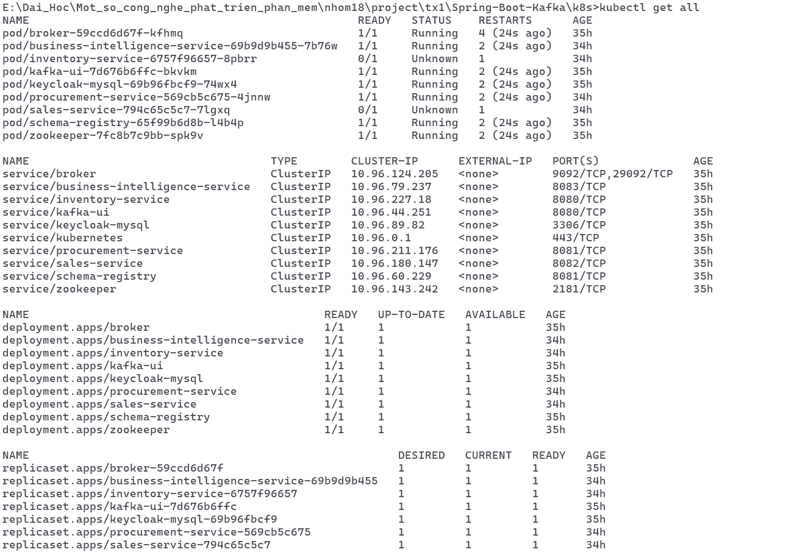

# Bài thường xuyên 1 nhóm 18 môn học "Một số công cụ phát triển phần mềm"

## Mô tả
Thực hiện tìm hiểu dự án [Spring boot kafka](https://github.com/nbadran/Spring-Boot-Kafka.git)
các công việc thực hiện
- Tìm hiểu lý thuyết các phân tích thiết kế DDD
- Tìm hiểu cấu trúc của dự án và cách phân tích thiết kế DDD của sự án
- Triển khai docker và kubernetes với Kind

## Cấu trúc dự án 
thực hiện theo kiến trúc phân tầng, phân chia trách nhiệm giữa các lớp. Gồm có 4 dịch vụ chính

- Procurement Service
- Inventory Service
- Sales Service
- Business Intelligence (BI) Service

## chạy kubernet

1. cài đặt [kind](https://kind.sigs.k8s.io/)
2. cài đặt [Kubectl](https://kubernetes.io/docs/tasks/tools/)
3. tạo cluster: chạy file k8s/kind/create-kind-cluster.sh
```bash
./k8s/kind/create-kind-cluster.sh
```
4. triển khai cấu hình cho cluster
```bash
kubectl appply -f infrastructure
kubectl appply -f application
```
5. kiểm tra hoạt động
```bash
kubectl get all
```



